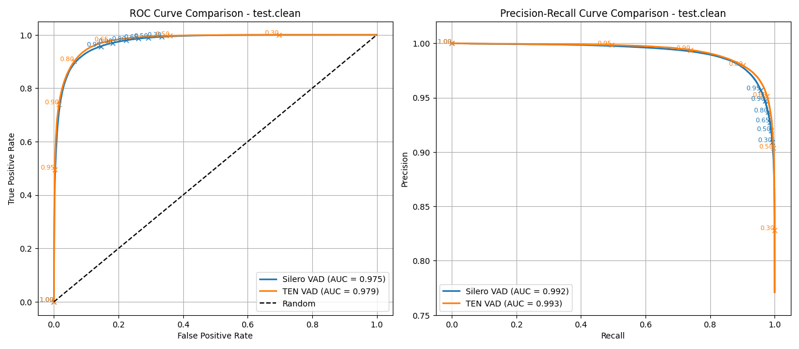
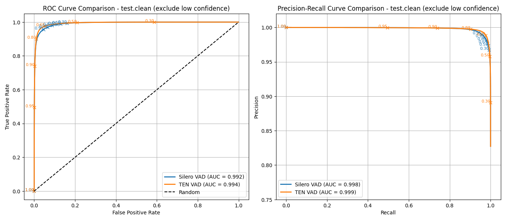
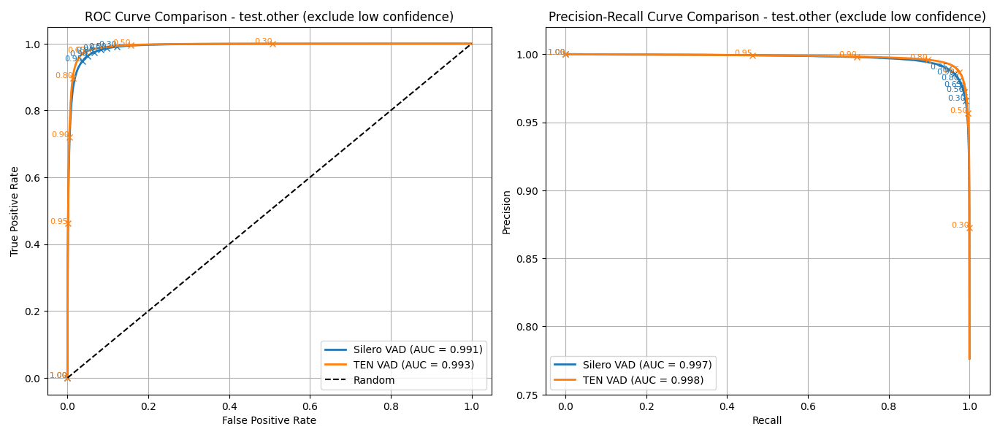

AUC metrics comparison for two voice activity detection (VAD) models.

Test Dataset Cards on HuggingFace.
- English: https://huggingface.co/datasets/guynich/multilingual_librispeech_test_vad
- Multilingual https://huggingface.co/datasets/guynich/librispeech_asr_test_vad

VAD Models:
- [Silero VAD](https://github.com/snakers4/silero-vad)
- [TEN VAD](https://github.com/TEN-framework/ten-vad)

# Introduction

This repo computes AUC metrics for two test datasets with VAD models.

# Installation

This section describes installation for the code in this repo.

| Note: on a second computer this install did not run main.py successfully (.so file not found).

The first step is to clone this repo.
```sh
cd
git clone git@github.com:guynich/vad_eval_comparison.git
```

The main script has dependencies.  For these steps I used Ubuntu 22.04 and
Python `venv` virtual environment.  TEN VAD requires libc++1.  The script plots
require tkinter.
```sh
sudo apt update
sudo apt install libc++1
sudo apt install python3.10-venv
sudo apt-get install python3-tk

cd
python3 -m venv venv_vad_eval_comparison
source ./venv_vad_eval_comparison/bin/activate

cd vad_eval_comparison

python3 -m pip install --upgrade pip
python3 -m pip install -r requirements.txt
python3 -m pip install -U --force-reinstall -v git+https://github.com/TEN-framework/ten-vad.git
```

# Run the test script

Script coded with help from ChatGPT and Copilot.

```sh
cd
source ./venv_vad_eval_comparison/bin/activate
cd vad_eval_comparison

python3 main.py
```

Both models use an audio chunk size of 512 samples at 16000Hz.

## Results

Test setup.
* Ubuntu 22.04.5 LTS
* Python 3.10.9
* Numpy 1.26.4

The following plots are for English language splits.  Plots for
seven other languages are in the images folder.

### test.clean



Speech features marked as low confidence are excluded in the following plot.  See
[Dataset Card](https://huggingface.co/datasets/guynich/librispeech_asr_test_vad)
for discussion.



### test.other


Speech features marked as low confidence are excluded in the following plot.  See
[Dataset Card](https://huggingface.co/datasets/guynich/librispeech_asr_test_vad)
for discussion.



ROC AUC

| Split       | Silero VAD | TEN VAD |
| ----------- | ---------- | ------- |
| test.clean  | 0.975      | 0.979   |
| test.other  | 0.969      | 0.978   |

PR AUC

| Split       | Silero VAD | TEN VAD |
| ----------- | ---------- | ------- |
| test.clean  | 0.992      | 0.993   |
| test.other  | 0.986      | 0.990   |

Similar trend in AUC values is seen with the seven languages from the multilingual
dataset.

```
Overall results:
{'test.clean_Silero VAD': AUCMetrics(roc_auc=0.9749639873286956,
                                     pr_auc=0.9916533637164553),
 'test.clean_Silero VAD_confidence': AUCMetrics(roc_auc=0.992260886130102,
                                                pr_auc=0.9982586011226073),
 'test.clean_TEN VAD': AUCMetrics(roc_auc=0.9788089652114291,
                                  pr_auc=0.9929890808788333),
 'test.clean_TEN VAD_confidence': AUCMetrics(roc_auc=0.9937211242712584,
                                             pr_auc=0.9985460881376557),
 'test.other_Silero VAD': AUCMetrics(roc_auc=0.9690341897727688,
                                     pr_auc=0.9856187361132123),
 'test.other_Silero VAD_confidence': AUCMetrics(roc_auc=0.9914300840606078,
                                                pr_auc=0.9971949276641505),
 'test.other_TEN VAD': AUCMetrics(roc_auc=0.9779214115059086,
                                  pr_auc=0.9902107761153177),
 'test.other_TEN VAD_confidence': AUCMetrics(roc_auc=0.9934622659489598,
                                             pr_auc=0.9978043365823898),
 'test.dutch_Silero VAD': AUCMetrics(roc_auc=0.9766509685712303,
                                     pr_auc=0.9893573682725301),
 'test.dutch_Silero VAD_confidence': AUCMetrics(roc_auc=0.993202108528278,
                                                pr_auc=0.9978201283022134),
 'test.dutch_TEN VAD': AUCMetrics(roc_auc=0.9808309147485922,
                                  pr_auc=0.991373746288227),
 'test.dutch_TEN VAD_confidence': AUCMetrics(roc_auc=0.9958535033620977,
                                             pr_auc=0.9986423468320182),
 'test.french_Silero VAD': AUCMetrics(roc_auc=0.9878548942374121,
                                      pr_auc=0.995840364550055),
 'test.french_Silero VAD_confidence': AUCMetrics(roc_auc=0.9958094161468629,
                                                 pr_auc=0.9989344976993809),
 'test.french_TEN VAD': AUCMetrics(roc_auc=0.9904210656907801,
                                   pr_auc=0.9966778475859583),
 'test.french_TEN VAD_confidence': AUCMetrics(roc_auc=0.9972771776468694,
                                              pr_auc=0.9992952183311781),
 'test.german_Silero VAD': AUCMetrics(roc_auc=0.9840970093414404,
                                      pr_auc=0.9945442431579096),
 'test.german_Silero VAD_confidence': AUCMetrics(roc_auc=0.9948651916456586,
                                                 pr_auc=0.9987078812762121),
 'test.german_TEN VAD': AUCMetrics(roc_auc=0.9855612728006675,
                                   pr_auc=0.994837361641464),
 'test.german_TEN VAD_confidence': AUCMetrics(roc_auc=0.995878878481617,
                                              pr_auc=0.9988699666739549),
 'test.italian_Silero VAD': AUCMetrics(roc_auc=0.9848628923832952,
                                       pr_auc=0.9951884800012321),
 'test.italian_Silero VAD_confidence': AUCMetrics(roc_auc=0.996019039338777,
                                                  pr_auc=0.9991608482709256),
 'test.italian_TEN VAD': AUCMetrics(roc_auc=0.9877299487593104,
                                    pr_auc=0.9961820137691056),
 'test.italian_TEN VAD_confidence': AUCMetrics(roc_auc=0.9969824633855008,
                                               pr_auc=0.9993686256572233),
 'test.polish_Silero VAD': AUCMetrics(roc_auc=0.9876797189675741,
                                      pr_auc=0.9967085219917624),
 'test.polish_Silero VAD_confidence': AUCMetrics(roc_auc=0.9983348721125866,
                                                 pr_auc=0.9996892280154609),
 'test.polish_TEN VAD': AUCMetrics(roc_auc=0.9882354348454382,
                                   pr_auc=0.9967940747715118),
 'test.polish_TEN VAD_confidence': AUCMetrics(roc_auc=0.9984766242330555,
                                              pr_auc=0.9997035896128622),
 'test.portuguese_Silero VAD': AUCMetrics(roc_auc=0.9834079447848605,
                                          pr_auc=0.994732499107326),
 'test.portuguese_Silero VAD_confidence': AUCMetrics(roc_auc=0.9950821261046421,
                                                     pr_auc=0.9989033765096149),
 'test.portuguese_TEN VAD': AUCMetrics(roc_auc=0.989382602936068,
                                       pr_auc=0.9965886797786941),
 'test.portuguese_TEN VAD_confidence': AUCMetrics(roc_auc=0.9970510315048995,
                                                  pr_auc=0.9992842425990767),
 'test.spanish_Silero VAD': AUCMetrics(roc_auc=0.9806427583650428,
                                       pr_auc=0.9925636537302218),
 'test.spanish_Silero VAD_confidence': AUCMetrics(roc_auc=0.9945154598613849,
                                                  pr_auc=0.998513513101432),
 'test.spanish_TEN VAD': AUCMetrics(roc_auc=0.9850378402400313,
                                    pr_auc=0.9946046773939126),
 'test.spanish_TEN VAD_confidence': AUCMetrics(roc_auc=0.9953977239427112,
                                               pr_auc=0.9987394825998995)}

```

### Comments

* TEN VAD AUC values are up to 1% higher than Silero VAD for this dataset.  These results do not include any quantification of the significance of this difference.
  * Excluding the low confidence examples reduces this difference.
* Threshold values [0., 1.]: TEN VAD has wider operating points than Silero VAD so different threshold numerical value need to chosen depending on model and your application
  * Comparing both models with the same value for threshold (e.g.: 0.5) could be misleading.
  * For example if your application has a target false positive rate then chose threshold value per model operation characteristic.

# Next steps

* [x] Multilingual test dataset.
* [ ] Reset TEN VAD model state between examples [link](https://github.com/TEN-framework/ten-vad/issues/16).
* [ ] TED VAD optimized for hop size of [160/256 samples](https://github.com/ten-framework/ten-vad?tab=readme-ov-file#5-supproted-sampling-rate-and-hop-size).  The dataset `speech` feature and code here uses 512 samples.
* [ ] Installation on a second computer has error running main.py: `OSError: ../venv_vad_eval_comparison/lib/python3.10/site-packages/./ten_vad_library/libten_vad.so: cannot open shared object file: No such file or directory`.
