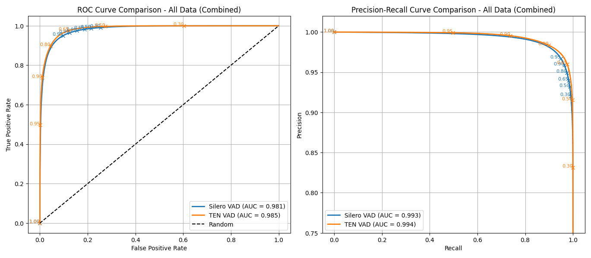
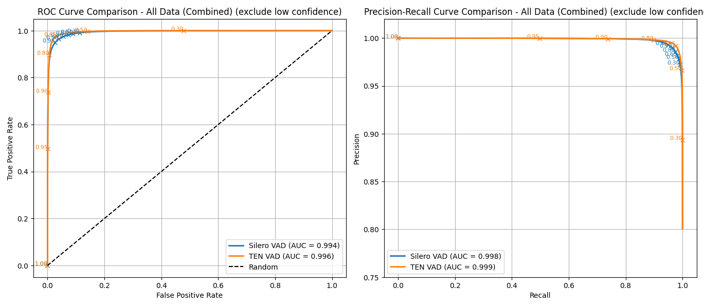

AUC metrics comparison for two voice activity detection (VAD) models.

Test Dataset Cards on HuggingFace.
- English: https://huggingface.co/datasets/guynich/librispeech_asr_test_vad
- Multilingual: https://huggingface.co/datasets/guynich/multilingual_librispeech_test_vad

VAD Models:
- [Silero VAD](https://github.com/snakers4/silero-vad)
- [TEN VAD](https://github.com/TEN-framework/ten-vad)

# Introduction

This repo computes AUC metrics for VAD models with data combined from two test
datasets.

# Installation

This section describes installation for the code in this repo.

| Note: requires x64 CPU.  TEN VAD does not support ARM CPU with Python on Linux.

The first step is to clone this repo.
```sh
cd
git clone git@github.com:guynich/vad_eval_comparison.git
```

The main script has dependencies.  For these steps I used Ubuntu 22.04 and
Python `venv` virtual environment.  TEN VAD requires libc++1.  The script plots
require tkinter.
```sh
sudo apt update
sudo apt install libc++1
sudo apt install python3.10-venv
sudo apt-get install python3-tk

cd
python3 -m venv venv_vad_eval_comparison
source ./venv_vad_eval_comparison/bin/activate

cd vad_eval_comparison

python3 -m pip install --upgrade pip
python3 -m pip install -r requirements.txt
python3 -m pip install -U --force-reinstall -v git+https://github.com/TEN-framework/ten-vad.git
```

# Run the test script

Script coded with help from ChatGPT and Copilot.

```sh
cd
source ./venv_vad_eval_comparison/bin/activate
cd vad_eval_comparison

python3 main.py
```

Both models use an audio chunk size of 512 samples at 16000Hz.

## Results

Test setups.
* x64 Intel Xeon
* Ubuntu 22.04.5 LTS
* Python 3.10.9
* Numpy 1.26.4

The following plots are for data combined from all test splits.



Speech features marked as low confidence are excluded in the following plot.  See
[Dataset Card](https://huggingface.co/datasets/guynich/librispeech_asr_test_vad)
for discussion.



Plots for each test split are in the images folder and corresponding auc values
are in file
[text file](images/results_auc.txt).

### Receiver Operating Characteristic AUC

| Splits | Silero VAD | TEN VAD | Notes |
| ------ | ---------- | ------- | ----- |
| all    | 0.981      | 0.985   |       |
| all    | 0.994      | 0.996   | exclude low confidence (~7%) |

### Performance Recall AUC

| Splits | Silero VAD | TEN VAD | Notes |
| ------ | ---------- | ------- | ----- |
| all    | 0.993      | 0.994   |       |
| all    | 0.998      | 0.999   | exclude low confidence (~7%) |

### Comments

* TEN VAD AUC values are similar to Silero VAD for these speech data.
* Threshold value selection: TEN VAD has wider operating points than Silero VAD so different threshold numerical value need to chosen depending on model choice and your application
  * Comparing both models with the same value for threshold (e.g.: 0.5) could be misleading.
  * For example if your application has a target false positive rate then choose threshold value per model operation characteristic.

# Next steps

* [x] Multilingual test dataset.
* [x] Reset TEN VAD model state [link](https://github.com/TEN-framework/ten-vad/issues/16).
* [ ] TED VAD optimized for hop size of [160/256 samples](https://github.com/ten-framework/ten-vad?tab=readme-ov-file#5-supproted-sampling-rate-and-hop-size).  The dataset `speech` feature and code here uses 512 samples.
* [x] Installation on ARM CPU (Python, Linux) not supported by TEN VAD.
* [x] Overall AUC for all splits.
