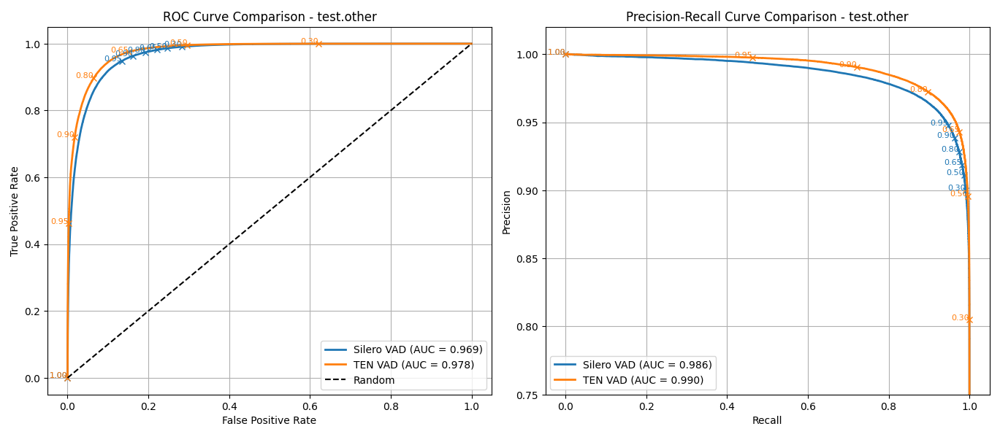

AUC metrics comparison for two voice activity detection (VAD) models.

Test Dataset Card on HuggingFace.
https://huggingface.co/datasets/guynich/librispeech_asr_test_vad

VAD Models:
- [Silero VAD](https://github.com/snakers4/silero-vad)
- [Ten VAD](https://github.com/TEN-framework/ten-vad)

# Introduction

This repo computes AUC metrics for the test dataset with VAD models.

# Installation

This section describes installation for the code in this repo.

The first step is to clone this repo.
```sh
cd
git clone git@github.com:guynich/vad_eval_comparison.git
```

The main script has dependencies.  For these steps I used Ubuntu 22.04 and
Python `venv` virtual environment.  TEN VAD requires libc++1.  The script plots
require tkinter.
```sh
sudo apt install libc++1
sudo apt install -y python3.10-venv
sudo apt-get install python3-tk

cd
python3 -m venv venv_vad_eval_comparison
source ./venv_vad_eval_comparison/bin/activate

cd vad_eval_comparison

python3 -m pip install --upgrade pip
python3 -m pip install -r requirements.txt
python3 -m pip install -U --force-reinstall -v git+https://github.com/TEN-framework/ten-vad.git
```

# Run the test script

Script coded with help from ChatGPT and Copilot.

```sh
cd
source ./venv_vad_eval_comparison/bin/activate
cd vad_eval_comparison

python3 main.py
```

Both models use an audio chunk size of 512 samples at 16000Hz.

## Results

Test setup.
* Ubuntu 22.04.5 LTS
* Python 3.10.9
* Numpy 1.26.4

### test.clean


Speech features marked as low confidence are excluded in the following plot.  See
[Dataset Card](https://huggingface.co/datasets/guynich/librispeech_asr_test_vad)
for discussion.


### test.other



Speech features marked as low confidence are excluded in the following plot.  See
[Dataset Card](https://huggingface.co/datasets/guynich/librispeech_asr_test_vad)
for discussion.


```
Overall results:
{'test.clean_Silero VAD': AUCMetrics(roc_auc=0.9749639873286956,
                                     pr_auc=0.9916533637164553),
 'test.clean_Silero VAD_confidence': AUCMetrics(roc_auc=0.992260886130102,
                                                pr_auc=0.9982586011226073),
 'test.clean_TEN VAD': AUCMetrics(roc_auc=0.9788089652114291,
                                  pr_auc=0.9929890808788333),
 'test.clean_TEN VAD_confidence': AUCMetrics(roc_auc=0.9937211242712584,
                                             pr_auc=0.9985460881376557),
 'test.other_Silero VAD': AUCMetrics(roc_auc=0.9690341897727688,
                                     pr_auc=0.9856187361132123),
 'test.other_Silero VAD_confidence': AUCMetrics(roc_auc=0.9914300840606078,
                                                pr_auc=0.9971949276641505),
 'test.other_TEN VAD': AUCMetrics(roc_auc=0.9779214115059086,
                                  pr_auc=0.9902107761153177),
 'test.other_TEN VAD_confidence': AUCMetrics(roc_auc=0.9934622659489598,
                                             pr_auc=0.9978043365823898)}
```

ROC AUC

| Split       | Silero VAD | TEN VAD |
| ----------- | ---------- | ------- |
| test.clean  | 0.975      | 0.979   |
| test.other  | 0.969      | 0.978   |

PR AUC

| Split       | Silero VAD | TEN VAD |
| ----------- | ---------- | ------- |
| test.clean  | 0.992      | 0.993   |
| test.other  | 0.986      | 0.990   |


### Comments

* TEN VAD AUC values are up to 1% higher than Silero VAD for this dataset.  These results do not include any quantification of the significance of this difference.
  * Excluding the low confidence examples reduces this difference.
* Threshold values [0., 1.]: TEN VAD has wider operating points than Silero VAD so different threshold numerical value need to chosen depending on model and your application
  * For example if your application has a target false positive rate then chose threshold value per model operation characteristic.
* TEN VAD configuration:
  * May perform differently with chunk size of 256.  The dataset `speech` feature and code here uses 512 samples.
  * May need different code to reset TEN VAD model state between examples in this testing.
